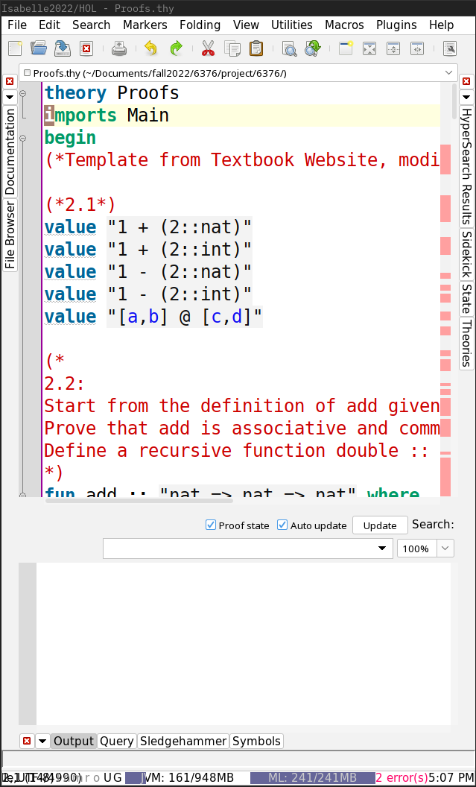

# Final Report Code and Instructions

## Tested Instruction Execution Environment

- OS: Fedora release 36 (Thirty Six) x86_64
- Kernel: 6.0.12-200.fc36.x86_64
- Shell: zsh
- CPU: Intel i7-7500U (4) @ 3.500GHz
- GPU: Intel HD Graphics 620
- Memory: 16giB

NOTE: Any Linux distribution should be compatible

## [Isabelle Proofs.thy file](./Proofs.thy)

This file contains exercises from Chapter 2 of [Concrete Semantics](http://concrete-semantics.org/)

### Instructions

- download and run Isabelle

```sh
wget https://isabelle.in.tum.de/dist/Isabelle2022_linux.tar.gz
tar -xzf Isabelle2022_linux.tar.gz
cd Isabelle2022
./Isabelle2022
```

- Open Proofs.thy file by selecting: file -> open -> Proofs.thy
- Select Output, and turn on Proof State and Auto update (See screenshot)



- Scroll down (somewhat slowly) to see output/proof state
- If there are any red exclamation marks, then it did not work properly (squiggly lines are fine)

## [Haskell tree files](./tree)

This directory contains a mirrored implementation of a binary tree of the Isabelle tree code to show similarity

### Instructions

- Go into [tree directory](./tree)

```
cd tree
```

- build docker image

```
docker build -t ./
```

- execute image

```
docker run tree
```
